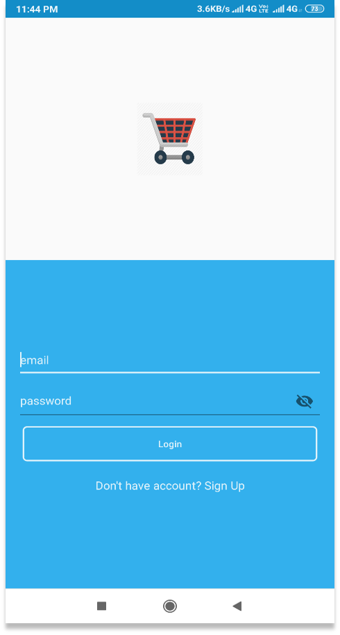
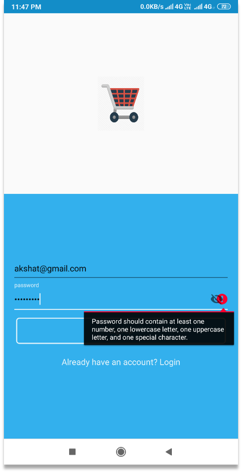
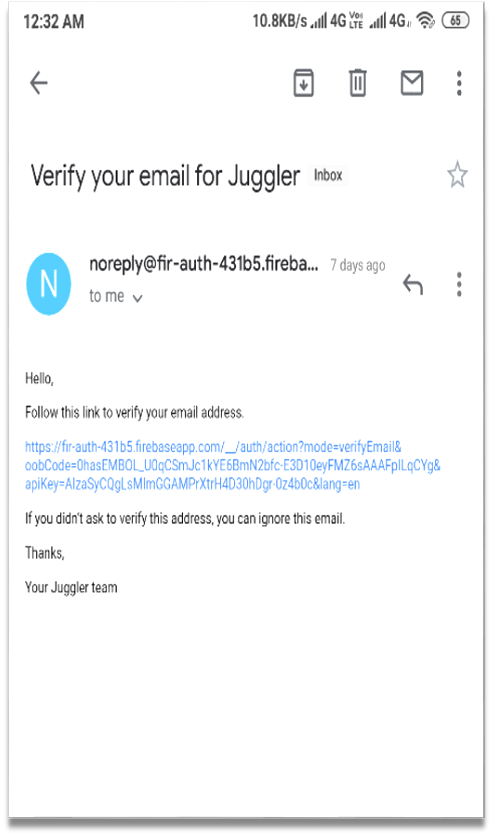
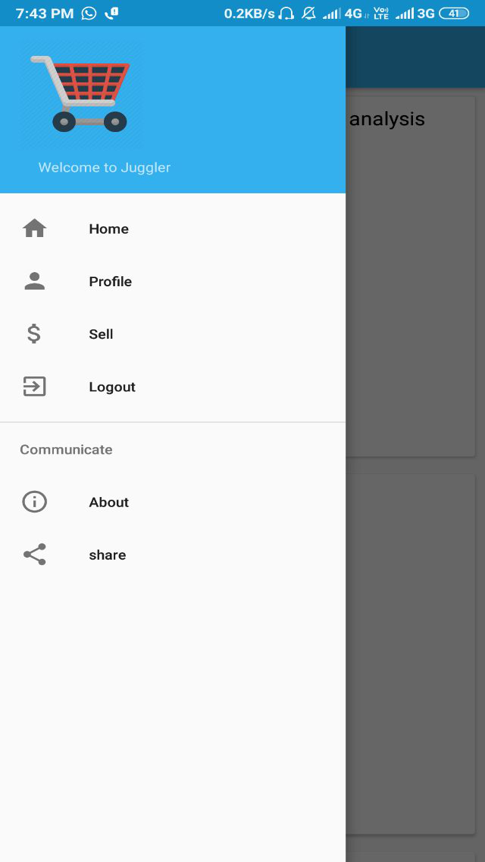
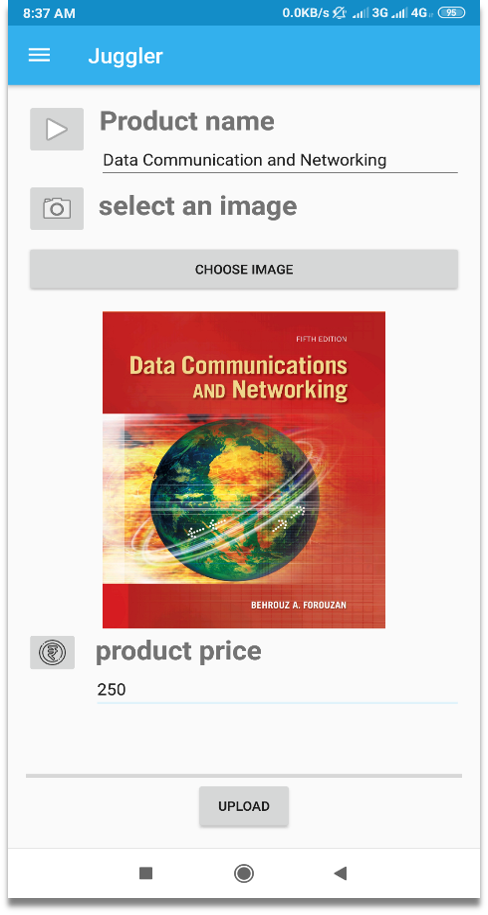
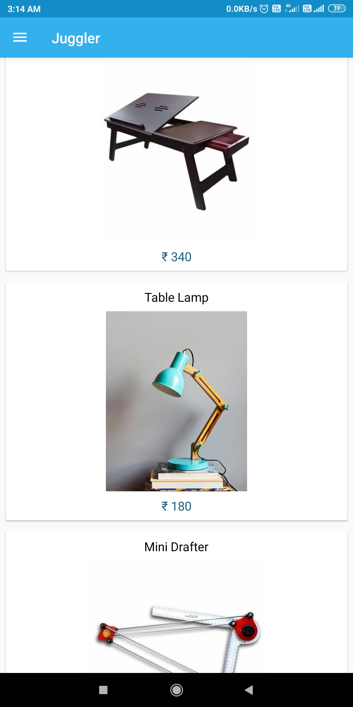
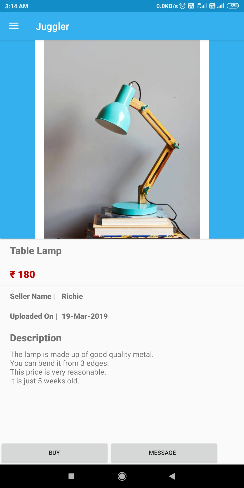

# Juggler

Juggler is an android app for selling and buying of old goods within a college or in an organization.

## Tools and Technology
- Android Studio
- Firebase
- Java 8

## Build Config
- Api 23: Android 6.0(marshmallow)
- Gradle: 3.2.0

## Screenshots

#### 1. Login

#### 2. Signup

#### 3. Email verification

#### 4. Navigation Drawer

#### 5. Upload Product

#### 6. Home Page

#### 7. Select Item

#### 8. Send email message

#### 9. Feedback

## Demo
[Download apk](https://github.com/git-akshat/mini-project/releases/download/v16.6.19-alpha/Juggler-v16.6.19.apk)

Auto-reply email and email-notifications are disabled. To enable it go to Config.java file and provide email id and password.

## Developed by
[`Akshat Agarwal`](https://github.com/git-akshat)

## MIT License
Copyright (c) 2019 Akshat Agarwal
